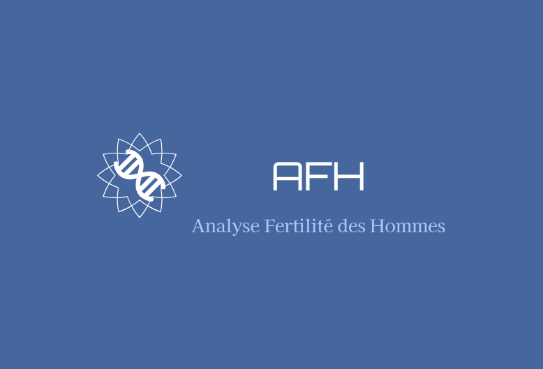

# Projet AFH

 

## Projet d’Analyse de Fertilité des Hommes.

## Sommaire

1. [Objectifs du projet](#objectifs-primordiaux-de-ce-projet)
2. [Livrables attendus](#Livrables-attendus)
3. [Instructions pour bien démarrer le projet AFH](#instructions-pour-bien-démarrer-le-projet-afh)
   1. [Création de l'environnement virtuel](#1-création-de-lenvironnement-virtuel)
   2. [Activation de l'environnement virtuel](#2-activation-de-lenvironnement-virtuel)
   3. [Installation des dépendances](#3-instalation-des-dépendances-ou-paquets-dans-lenvironnement-virtuel)
   4. [Navigation dans le dossier backend](#4-navigation-dans-le-dossier-backend)
   5. [Démarrage du serveur backend](#5-démarage-du-serveur-backend)
   6. [Migration des données de la base de données](#6-migrer-les-données-de-la-base-de-données)
4. [1er dataset](#dataset-human-sperm-head-morphology-dataset-hushem)
5. [2eme dataset](#dataset---fertility)
6. [Prérequis](./requirements.txt)
7. [Dévelopement du site web avec la solution IA](#création-dun-modèle-ia-utilisable-sur-un-site-web-avec-vuejs-3-et-django)
8. [Documentation API](#documentation-api)
9. [Contributions](#contributions)

---

# Objectifs primordiaux de ce projet :

- Faire la veille sur les modèles et méthodes existants pour le diagnostic de la fertilité masculine
- Analyser et nettoyer cette base de données (photos et données cliniques)
- Proposer un modèle d'IA entraîné pour détecter les hommes ayant un problème de fertilité
- Proposer un protocole de diagnostic pour que le client puisse utiliser votre modèle
- Présenter le modèle au client ainsi que la procédure utilisée pour faire un diagnostic.

## Livrables attendus

- Application en ligne
- Versionné sous GitHub (incluant modèle entraîné, le notebook)
- Code documenté (incluant procédure d'installation nouveau poste dev, procédure d'entraînement du modèle, protocole d'utilisation de l'application)
- Application dockerisé pour le développement
- Route définit en API REST et testé unitairement
- Un trello de la plannification de votre développement, des screenshots périodique de l'état de votre trello

---

# Instructions pour bien démarrer le projet AFH

Ces dernières vont vous permettre de créer un environnement virtuel, y installer les bonnes dépendances, le faire fonctionner et aussi utiliser un conteneur Docker

### **1. Création de l'environnement virtuel**

Ce dernier ira contenir toutes nos dépendances (Paquets)\
Utiliser la commande suivante dans votre terminal (Powershell) :

```sh
python -m venv ./venv
```

---

### **2. Activation de l'environnement virtuel**

Avec Powershell

```sh
.\venv\Scripts\activate
```

ou avec CMD

```sh
.\venv\Scripts\activate.bat
```

Pour le désactiver utiliser la commande suivante si-besoin:

```sh
deactivate
```

---

### **3. Instalation des dépendances (Ou paquets) dans l'environnement virtuel**

```sh
pip install -r requirements.txt
```

---

### **4. Navigation dans le dossier backend**

```sh
cd .\backend\
```

---

### **5. Démarage du serveur backend**

```sh
py manage.py runserver
```

---

### **6. Migrer les données de la base de données**

```sh
py manage.py migrate
```

---

## Dataset Human Sperm Head Morphology dataset (HuSHeM)

Le dataset "Human Sperm Head Morphology dataset (HuSHeM)" est composé de quatre dossiers, chacun contenant des images de têtes de spermatozoïdes classées selon leur morphologie. Voici un résumé des informations clés :

- **Dossiers :**

  **1. Normal :** Contient environ 50 images de têtes de spermatozoïdes avec une morphologie normale.\
  **2. Tapered :** Contient environ 50 images de têtes de spermatozoïdes de morphologie conique (Tapered).\
  **3. Pyriform :** Contient environ 50 images de têtes de spermatozoïdes de morphologie piriforme (Pyriform).\
  **4. Amorphous :** Contient environ 50 images de têtes de spermatozoïdes de morphologie amorphe (Amorphous).

- **Format des images :** RGB
- **Résolution des images** : 131x131 pixels

Ces images serviront à entraîner notre modèle d'intelligence artificielle pour détecter la morphologie anormale des têtes de spermatozoïdes et ainsi aider à diagnostiquer les problèmes de fertilité masculine.

## Dataset - Fertility

Le fichier CSV "fertility" contient des informations cliniques liées à la fertilité masculine pour chaque individu de l'étude. Voici un résumé des colonnes et des informations qu'elles contiennent :

- **Colonnes du csv :**

  **1. Season :** Saison durant laquelle l'analyse a été effectuée (printemps, automne, etc.).\
  **2. Age :** Âge de l'individu au moment de l'analyse.\
  **3. Childish diseases :** Indique si l'individu a eu des maladies infantiles (oui/non).\
  **4. Accident or serious trauma :** Indique si l'individu a subi un accident ou un traumatisme grave (oui/non).\
  **5. Surgical intervention :** Indique si l'individu a subi une intervention chirurgicale (oui/non).\
  **6. High fevers in the last year :** Indique la fréquence des hautes fièvres dans l'année précédente (jamais, moins de 3 mois auparavant, plus de 3 mois auparavant).\
  **7. Frequency of alcohol consumption :** Fréquence de consommation d'alcool (jamais, occasionnelle, une fois par semaine, plusieurs fois par semaine, plusieurs fois par jour).\
  **8. Smoking habit :** Habitude de fumer (jamais, occasionnelle, quotidienne).\
  **9. Number of hours spent sitting per day :** Nombre d'heures passées assis par jour.\
  **10. Diagnosis :** Diagnostic de fertilité (Normal/Altered).

Ces informations cliniques seront utilisées en conjonction avec les images du premier dataset pour entraîner notre modèle d'intelligence artificielle et détecter les problèmes de fertilité masculine en fonction de la morphologie des têtes de spermatozoïdes.

Pour en savoir plus sur la procédure d'utilisation du dataset et son intégration dans notre modèle, veuillez consulter la section [Instructions pour bien démarrer le projet AFH](#voici-ci-dessous-les-instructions-pour-bien-démarrer-le-projet-afh) dans ce README.

---


## Création d'un modèle IA utilisable sur un site web avec Vue.js 3 et Django

Pour créer un modèle IA utilisable sur un site web avec Vue.js 3 et un backend Django, voici les étapes que vous pouvez suivre :

**1. Prétraitement des données :**
   - Pour les images du dataset "Human Sperm Head Morphology dataset (HuSHeM)", vous devrez les prétraiter pour les redimensionner à une taille appropriée, les normaliser et les convertir en tenseurs. Vous pouvez utiliser des bibliothèques Python comme OpenCV et PyTorch pour cela.
   - Pour les données cliniques du dataset "Fertility", vous devrez effectuer une normalisation des valeurs numériques et encoder les valeurs catégorielles si nécessaire.
___
**2. Entraînement du modèle IA :**
   - Vous pouvez utiliser une architecture de réseau de neurones convolutifs (CNN) pour l'analyse des images. PyTorch est une excellente bibliothèque pour créer et entraîner des CNN. Vous pouvez utiliser le dataset "Human Sperm Head Morphology dataset (HuSHeM)" pour entraîner le modèle à reconnaître les différentes morphologies de spermatozoïdes.
   - Pour inclure les données cliniques, vous pouvez les concaténer avec les caractéristiques extraites par le CNN et les utiliser comme entrée supplémentaire pour votre modèle. Vous pouvez utiliser une architecture de réseau neuronal dense (DNN) pour la partie clinique.
   - Enfin, vous pouvez combiner les sorties du CNN et du DNN pour obtenir une prédiction finale de fertilité.
___
**3. Exportation et intégration du modèle :**
   - Une fois le modèle entraîné, vous pouvez l'exporter dans un format compatible avec PyTorch, comme ONNX, pour le rendre indépendant du framework spécifique.
   - Vous devrez créer une API REST avec Django pour servir le modèle. Cette API prendra les images et les données cliniques en entrée, effectuera le prétraitement nécessaire, puis utilisera le modèle pour effectuer la prédiction.
   - Vous pouvez utiliser des bibliothèques comme Django REST framework pour créer facilement l'API.
___
**4. Frontend avec Vue.js 3 :**
   - Dans le frontend de votre application Vue.js 3, vous pouvez créer un formulaire où les utilisateurs peuvent télécharger une image et entrer les informations cliniques.
   - Lorsque l'utilisateur soumet le formulaire, vous pouvez envoyer les données au backend Django via des requêtes HTTP pour obtenir la prédiction de fertilité.
___
**5. Déploiement :**
   - Vous pouvez déployer le backend Django chez O2switch et utiliser un serveur de base de données MySQL pour stocker les données cliniques si nécessaire.
   - Le frontend Vue.js 3 peut être déployé sur un serveur web statique Nginx.
___
Il est important de noter que la création d'un modèle IA de qualité et son intégration dans une application web nécessitent une connaissance approfondie en IA, en développement web et en déploiement. Il est également essentiel de tester soigneusement l'application pour s'assurer qu'elle fonctionne correctement et de manière fiable.

Si vous n'êtes pas familier avec certains aspects de cette mise en œuvre, vous pouvez également envisager de collaborer avec des développeurs spécialisés en IA et en développement web pour vous aider dans ce projet.
